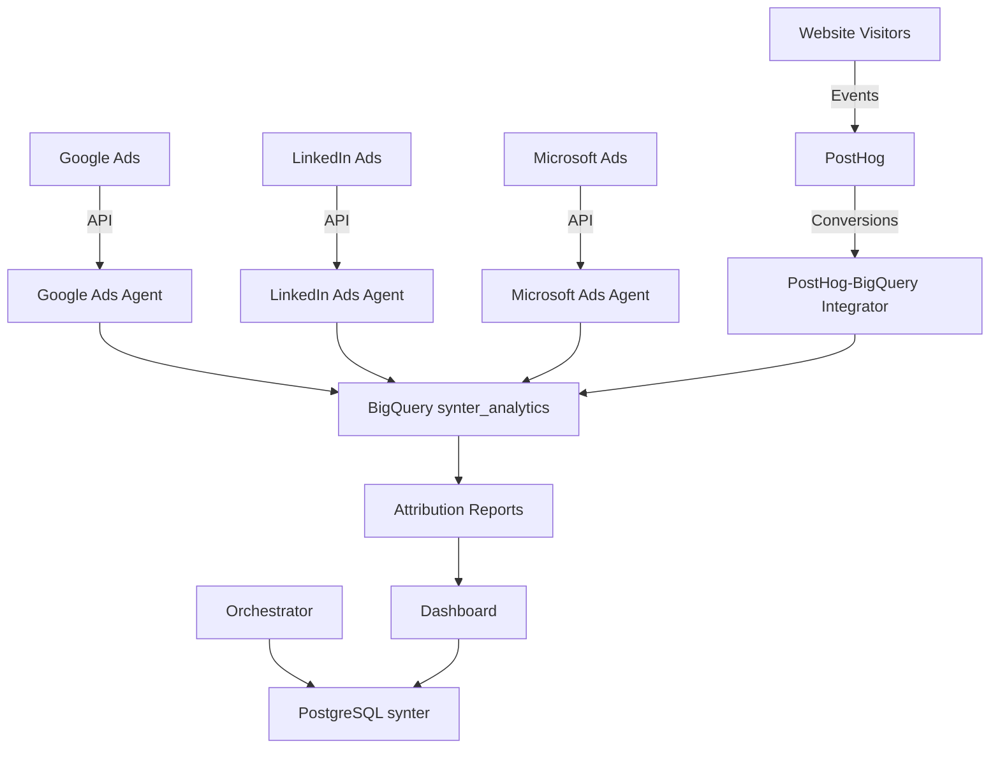

# Synter Database Cleanup & PostHog Integration - Summary

## ✅ Completed Tasks

### 1. Git Branch Consolidation
- ✅ Committed all changes from `sprint7-production-deployment` branch
- ✅ Merged into `main` branch
- ✅ Resolved branch conflicts and cleaned up repository

### 2. Database Cleanup
- ✅ **Removed duplicate PostgreSQL setup** (`agents/google-python/docker-compose.yml`)
- ✅ **Removed SQLite development database** (`packages/settings/prisma/dev.db`)
- ✅ **Replaced SingleStore with PostgreSQL** in main `docker-compose.yml`
- ✅ **Updated package.json** to use PostgreSQL (`pg`) instead of MySQL (`mysql2`)

### 3. Architecture Consolidation
- ✅ **Single PostgreSQL database** for all transactional data (auth, agent runs, policies)
- ✅ **BigQuery integration** maintained for analytics data (`synter_analytics` dataset)
- ✅ **Unified docker-compose.yml** with proper service dependencies and health checks

### 4. PostHog Integration Agent
- ✅ **Created PostHogBigQueryIntegrator** (`agents/posthog-integration/index.js`)
- ✅ **Attribution extraction** from PostHog events → BigQuery conversions/touchpoints
- ✅ **Cross-platform tracking** (Google, LinkedIn, Microsoft, Reddit, Twitter)
- ✅ **Multi-touch attribution** support (first-touch, last-touch, multi-touch)

### 5. Environment & Configuration
- ✅ **Created unified .env.template** with all required environment variables
- ✅ **Standardized configuration** across all services
- ✅ **Proper secret management** for production deployment

---

## 🏗️ Final Architecture

### Data Storage Strategy:
- **PostgreSQL** (`synter` database):
  - User authentication & sessions
  - Agent run logs & status
  - Campaign policies & configurations
  
- **BigQuery** (`synter_analytics` dataset):
  - Ad platform metrics (`ad_metrics`)
  - Conversion tracking (`conversions`) 
  - Attribution touchpoints (`touchpoints`)
  - Performance analytics tables

- **PostHog** (External SaaS):
  - Event tracking & user behavior
  - Cross-domain conversion attribution
  - Real-time analytics & insights

---

## 🔧 Technical Improvements

### Database Optimization:
- **Eliminated redundancy**: Single PostgreSQL instance vs. multiple databases
- **Clear separation**: Transactional data (PostgreSQL) vs Analytics data (BigQuery)
- **Better performance**: Optimized for specific use cases

### Integration Benefits:
- **Unified attribution**: PostHog events linked with ad platform data
- **Real-time conversion tracking**: Server-side PostHog → BigQuery pipeline
- **Cross-platform insights**: Complete customer journey from ads to conversion
- **Advanced attribution models**: First-touch, last-touch, multi-touch analysis

### Operational Benefits:
- **Simplified deployment**: Single docker-compose with clear dependencies
- **Standardized environment**: One .env template for all services
- **Better monitoring**: Health checks and proper service dependencies
- **Easier maintenance**: Clear data flow and single source of truth

---

## 🚀 Next Steps

### Immediate:
1. **Test consolidated setup**: `docker-compose up --build`
2. **Verify database connections**: Ensure all agents use PostgreSQL
3. **Test PostHog integration**: Run conversion sync to BigQuery
4. **Validate BigQuery schemas**: Ensure proper table creation

### Short-term:
1. **Deploy to production**: Update Railway/hosting environment variables
2. **Enable PostHog tracking**: Add to website/landing pages
3. **Configure attribution reports**: Set up automated BigQuery queries
4. **Monitor performance**: Ensure optimal resource usage

### Long-term:
1. **Advanced attribution models**: Time-decay, position-based attribution
2. **Real-time dashboards**: Live conversion tracking and alerts
3. **Cross-platform optimization**: Automated budget allocation based on attribution
4. **Enhanced analytics**: Custom conversion funnels and cohort analysis

---

## 📊 Impact

### Before Cleanup:
- 3+ separate databases (PostgreSQL, SQLite, SingleStore)
- Duplicate services and configurations
- Manual attribution tracking
- Complex deployment setup

### After Cleanup:
- 1 PostgreSQL + BigQuery for analytics
- Unified configuration and deployment
- Automated PostHog → BigQuery conversion pipeline
- Production-ready architecture with proper health checks

**Result**: Cleaner, faster, more maintainable system with advanced cross-platform attribution capabilities.
