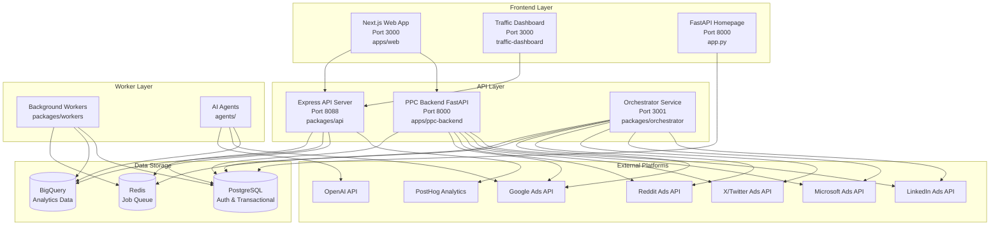

# Synter Media Media - Multi-Platform AI Advertising Agency

## Architecture Overview

Synter is a **monorepo-based, microservices architecture** for managing cross-platform advertising campaigns (Google Ads, Reddit, Twitter/X, Microsoft Ads, LinkedIn) with autonomous AI agents. The system is built using a hybrid tech stack with Node.js/TypeScript for core services and Python/FastAPI for AI features.



---

## Tech Stack

### Frontend
- **Next.js 15** (React 19) - Main web application
- **Tailwind CSS** - Styling
- **TypeScript** - Type safety
- **Prisma Client** - Database ORM
- **Framer Motion & GSAP** - Animations
- **PostHog** - Product analytics
- **Stripe** - Payment processing

### Backend Services
- **Node.js 18+** with TypeScript
- **Express.js** - API server (`packages/api`)
- **FastAPI** (Python 3.11) - PPC backend & AI services
- **IORedis** - Redis client for job queues
- **Pino** - Structured logging

### Data Layer
- **PostgreSQL** - User auth, sessions, subscriptions, campaign metadata
- **Google BigQuery** - Analytics data warehouse (metrics, conversions, attribution)
- **Redis** - Job queue (BullMQ), caching

### Package Manager & Build
- **pnpm** - Fast, disk-efficient package manager
- **pnpm workspaces** - Monorepo management
- **tsx** - TypeScript execution
- **Prisma** - Database migrations & schema management

---

## Repository Structure (Monorepo)

The project uses a **pnpm workspace monorepo** structure:

```
synter-clean/
├── apps/                          # Application packages
│   ├── web/                       # Next.js dashboard (main UI)
│   │   ├── src/app/              # Next.js 15 app router
│   │   ├── prisma/               # Prisma schema & migrations
│   │   ├── tests/                # Playwright E2E tests
│   │   └── package.json          # Next.js, Prisma, Stripe, PostHog
│   └── ppc-backend/              # Python FastAPI PPC service
│       ├── routers/              # API routes (sync, score, recommend)
│       ├── services/             # Business logic
│       ├── ads/                  # Platform integrations
│       ├── main.py               # FastAPI app entry
│       └── requirements.txt      # Python deps
│
├── packages/                      # Shared Node.js packages
│   ├── api/                      # Express API server (port 8088)
│   │   ├── src/
│   │   │   ├── routes/          # Auth, reports, agents, creative
│   │   │   ├── services/        # Business logic
│   │   │   ├── middleware/      # Auth, CORS
│   │   │   └── index.ts         # Express app
│   │   └── package.json
│   ├── workers/                  # Background job processors
│   │   ├── src/
│   │   │   ├── jobs/            # Job handlers
│   │   │   ├── queue-listener.ts
│   │   │   └── index.ts
│   │   └── package.json
│   ├── orchestrator/            # Agent orchestration (Docker service)
│   └── settings/                # Shared Prisma settings
│
├── agents/                       # AI agent implementations
│   ├── ai-campaign-agent/
│   └── posthog-integration/
│
├── scripts/                      # Utility scripts
│   ├── migrate.js               # Database migrations
│   ├── seed.js                  # Seed data
│   └── refresh-google-tokens.js # OAuth token management
│
├── migrations/                   # SQL migration files
├── schemas/                      # Schema definitions
├── docs/                         # Documentation
│
├── docker-compose.yml           # Local dev environment
├── Dockerfile                    # Production container
├── railway.toml                  # Railway deployment config
├── app.py                        # Standalone FastAPI homepage
├── requirements.txt              # Python dependencies
├── package.json                  # Root workspace config
├── pnpm-workspace.yaml          # Workspace definition
└── launch-complete.sh           # Complete startup script
```

---

## Key Components

### 1. Web Application (`apps/web`)
- **Framework**: Next.js 15 with App Router
- **Features**:
  - Marketing homepage & landing pages
  - Dashboard with real-time campaign analytics
  - Multi-platform ad account connections (OAuth flows)
  - User authentication (email/password, magic links, Google OAuth)
  - Subscription management (Stripe integration)
  - Credit system for usage-based billing
  - Team collaboration & invites
  - Waitlist & referral system
  - Ad footprint detection during onboarding
- **Database**: PostgreSQL via Prisma ORM
- **Routes**: 
  - `/` - Homepage
  - `/dashboard` - Main analytics dashboard
  - `/optimizations` - Campaign optimization recommendations
  - `/providers` - Connect ad platforms
  - `/credits` - Credit management
  - `/waitlist` - Beta waitlist

### 2. API Server (`packages/api`)
- **Framework**: Express.js + TypeScript
- **Port**: 8088
- **Endpoints**:
  - `/auth/*` - Authentication & authorization
  - `/reports/*` - Analytics reports & KPIs
  - `/agents/*` - AI agent management & triggers
  - `/creative/*` - Creative asset management
  - `/workflow/*` - Workflow automation
  - `/health` - Health check
- **Dependencies**: BigQuery client, Redis, MySQL2, Axios

### 3. PPC Backend (`apps/ppc-backend`)
- **Framework**: FastAPI (Python)
- **Port**: 8000
- **Features**:
  - Google Ads API integration with GAQL queries
  - Reddit, Twitter/X, Microsoft, LinkedIn Ads APIs
  - Campaign sync & data ingestion
  - ICP (Ideal Customer Profile) scoring
  - Optimization recommendations
  - Budget & bid management
  - OAuth callback handlers
  - Background scheduler for periodic tasks
- **Authentication**: HTTP Basic Auth
- **Database**: PostgreSQL via SQLAlchemy

### 4. Background Workers (`packages/workers`)
- **Purpose**: Process async jobs from Redis queue
- **Jobs**:
  - Data ingestion from ad platforms
  - Metric calculations
  - Report generation
  - Email notifications
- **Technologies**: IORedis, BullMQ pattern

### 5. AI Agents (`agents/`)
Autonomous agents as defined in `AGENTS.md`:
- **Ingestor Agents** (Google, Reddit, X) - Pull metrics every 2 hours
- **Touchpoint Extractor** - Derive attribution touchpoints (10-min intervals)
- **Conversion Uploader** - Push conversions back to platforms (nightly)
- **Budget Optimizer** - AI-powered budget adjustments (nightly)
- **Keywords Hydrator** - Keyword research (weekly)
- **Alerting Sentry** - Monitor & alert on failures (5-min intervals)

Each agent supports:
- `DRY_RUN` mode (no external API writes)
- `MOCK_PROVIDER` flags for development
- Idempotency & retry logic
- Watermark-based incremental processing

---

## Database Schema

### PostgreSQL Tables (via Prisma)

**Authentication & Users:**
- `users` - User accounts with roles (ADMIN, ANALYST, VIEWER)
- `sessions` - Session management with tokens
- `magic_links` - Passwordless authentication tokens
- `oauth_accounts` - Google OAuth linkage
- `platform_connections` - Ad platform OAuth connections (encrypted tokens)

**Campaign Management:**
- `campaigns` - Campaign metadata (platform, budget, status, objectives)
- `campaign_policies` - Optimization policies (target CAC, budget caps)
- `ad_metrics` - Aggregated metrics snapshot
- `touchpoints` - Attribution touchpoints (clicks, landing events)
- `conversions` - Conversion events

**Agent System:**
- `agent_runs` - Agent execution history & watermarks

**Billing & Subscription:**
- `subscriptions` - Stripe subscription data
- `purchases` - One-time credit purchases
- `credit_balances` - User credit balances
- `credit_transactions` - Credit transaction ledger
- `usage_records` - Feature usage tracking
- `webhook_events` - Stripe webhook processing

**Collaboration:**
- `team_members` - Team member roles
- `team_invites` - Pending team invitations
- `referrals` - Referral codes & tracking

**Onboarding:**
- `onboarding_scans` - Ad footprint detection scans
- `onboarding_scan_platforms` - Detected platforms per scan
- `waitlist_leads` - Beta waitlist management

### BigQuery Tables (Analytics Warehouse)
- `ad_metrics` - Daily aggregated metrics by platform/campaign/ad
- `touchpoints` - Click-level attribution data
- `conversions` - Conversion events
- `fact_attribution_last_touch` - Last-touch attribution model
- `events` - PostHog event data integration
- `keywords_external` - Keyword research data

---

## Deployment Configuration

### Docker Compose (`docker-compose.yml`)
Local development environment with:
- **PostgreSQL** (port 5432) - with health checks & migrations
- **Redis** (port 6379) - with persistence & LRU eviction
- **Orchestrator** (port 3001) - Agent service
- **Dashboard** (port 3000) - Next.js app

### Railway (`railway.toml`)
Multi-service deployment:
- **web-frontend** (Next.js on port 3000)
- **api-server** (Express on port 8088)
- **ai-services** (FastAPI on port 8000, Python 3.11)
- **workers** (Background jobs)

Environment variables auto-populated from Railway plugins (PostgreSQL, Redis).

### Production Dockerfile
- Base: `node:18-alpine`
- Includes pnpm workspace installation
- Builds all packages
- Generates Prisma client
- Exposes port 8088
- Start command: `pnpm start` (runs all services in parallel)

---

## Build & Development

### Scripts (`package.json`)

```bash
# Development
pnpm dev                    # Start all services in dev mode
pnpm build                  # Build all packages
pnpm start                  # Start all services in production mode

# Database
pnpm migrate                # Run database migrations
pnpm seed                   # Seed demo data
pnpm db:init                # Migrate + seed

# OAuth Token Management
pnpm tokens:check           # Check all API configurations
pnpm tokens:refresh         # Refresh all OAuth tokens
pnpm tokens:ads             # Refresh Google Ads token
pnpm reddit:auth            # Reddit OAuth flow

# Deployment
pnpm test:deploy            # Test deployment configuration
pnpm railway:init           # Initialize Railway project
```

### Launch Scripts

**`launch-complete.sh`** - Complete production-like startup:
1. Check environment variables
2. Install Python dependencies (FastAPI, SQLAlchemy, etc.)
3. Build Node.js services
4. Start FastAPI homepage (port 8000)
5. Start traffic dashboard (port 3000)
6. Start background workers

**Access Points:**
- Homepage: http://localhost:8000
- Dashboard: http://localhost:8000/dashboard
- Traffic Analytics: http://localhost:3000
- API Health: http://localhost:8000/health
- API Docs: http://localhost:8000/docs

### Makefile
```bash
make up                     # Start Docker Compose services
make down                   # Stop & remove containers
make migrate                # Run migrations
make seed                   # Seed data
make up-init                # Up + migrate + seed
make dev                    # Start API + workers in dev mode
```

---

## Authentication & Authorization

**Methods Supported:**
1. **Email + Password** (Argon2id hashing)
2. **Magic Links** (passwordless)
3. **Google OAuth 2.0**

**RBAC Roles:**
- `ADMIN` - Full access, can trigger agents & modify policies
- `ANALYST` - Can view & analyze data, trigger read-only operations
- `VIEWER` - Read-only dashboard access

**Session Management:**
- HttpOnly, Secure cookies
- JWT tokens for API access
- Session rotation support
- Device tracking (user agent, IP)

---

## External Integrations

### Ad Platforms
- **Google Ads** - Full GAQL query support, Enhanced Conversions
- **Microsoft Ads** - Campaign management via Bing Ads API
- **Reddit Ads** - Campaign & analytics APIs (mockable)
- **X/Twitter Ads** - Campaign APIs (mockable)
- **LinkedIn Ads** - Campaign management (mockable)

### Analytics & AI
- **Google BigQuery** - Data warehouse for all analytics
- **PostHog** - Product analytics & event tracking
- **OpenAI** - AI optimization suggestions & content generation
- **Anthropic Claude** - Alternative AI provider

### Services
- **Stripe** - Payment processing, subscriptions, webhooks
- **BuiltWith API** - Ad platform detection for onboarding
- **Postmark/Nodemailer** - Transactional emails
- **Google Search Console** - Organic search data

---

## Key Features

1. **Multi-Platform Campaign Management**
   - Unified dashboard for Google, Microsoft, Reddit, Twitter, LinkedIn
   - OAuth-based platform connections with token refresh
   - Mock modes for development (`MOCK_GOOGLE=true`, etc.)

2. **AI-Powered Optimization**
   - Autonomous agents for budget optimization
   - CAC/ROAS-based decision making
   - Creative generation with OpenAI
   - ICP (Ideal Customer Profile) scoring

3. **Attribution & Analytics**
   - Cross-channel attribution (last-touch, with future multi-touch)
   - BigQuery-based analytics warehouse
   - Real-time KPI dashboards
   - Conversion tracking & upload to platforms

4. **SaaS Features**
   - Subscription tiers (Free, Starter, Pro, Enterprise)
   - Usage-based credit system
   - Team collaboration & invites
   - Waitlist with referral system
   - Stripe webhook handling

5. **Developer Experience**
   - Monorepo with pnpm workspaces
   - Full TypeScript type safety
   - E2E testing with Playwright
   - Docker Compose for local dev
   - One-command launch scripts
   - Comprehensive documentation

---

## Environment Configuration

See `.env.example` for required variables:

**Critical Variables:**
- `DATABASE_URL` / `POSTGRES_URL` - PostgreSQL connection
- `BIGQUERY_PROJECT_ID` - GCP project for analytics
- `GOOGLE_APPLICATION_CREDENTIALS` - Service account JSON path
- `REDIS_URL` - Redis connection
- `JWT_SECRET` / `SESSION_SECRET` - Auth secrets
- Platform credentials for each ad network
- `OPENAI_API_KEY` - AI features
- `STRIPE_SECRET_KEY` - Payments

**Mock Flags for Development:**
```bash
MOCK_GOOGLE=false      # Real Google Ads API
MOCK_REDDIT=true       # Mock Reddit Ads
MOCK_TWITTER=true      # Mock Twitter Ads
MOCK_MICROSOFT=true    # Mock Microsoft Ads
MOCK_LINKEDIN=true     # Mock LinkedIn Ads
```

---

## Testing

- **E2E Tests**: Playwright in `apps/web/tests`
- **Test Commands**:
  ```bash
  pnpm test:e2e          # Run E2E tests
  pnpm test:e2e:ui       # Run with Playwright UI
  pnpm test:e2e:vercel   # Test against Vercel deployment
  ```
- **CI/CD**: GitHub Actions workflows in `.github/workflows`

---

## Documentation Files

The repository includes extensive documentation:
- `AGENTS.md` - Agent system architecture
- `SETUP.md` - Setup instructions
- `DEPLOYMENT_READY.md` - Deployment guide
- `GOOGLE_ADS_OAUTH_SETUP.md` - Google Ads integration
- `REDDIT_SETUP.md` - Reddit Ads setup
- `STRIPE_SETUP.md` - Payment integration
- `MIGRATION_GUIDE.md` - BigQuery migration

---

## Summary

This is a sophisticated **multi-service, polyglot (Node.js + Python) monorepo** designed for scalable, AI-powered advertising campaign management across multiple platforms, with comprehensive auth, billing, team collaboration, and autonomous optimization capabilities.
