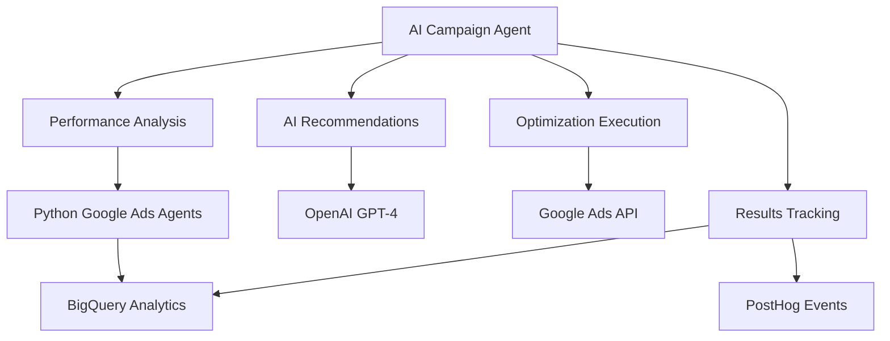

# 🤖 AI Campaign Agent for Sourcegraph Google Ads

## Overview
Intelligent campaign optimization agent that leverages AI to automatically optimize Sourcegraph's Google Ads campaigns for maximum ROI and performance.

## Features

### 🧠 **AI-Powered Optimization**
- **Performance Analysis**: Analyzes campaign data using existing Google Ads Python agents
- **AI Recommendations**: Uses OpenAI GPT-4 to generate optimization strategies
- **Automated Execution**: Implements optimizations via Google Ads API
- **Smart Safeguards**: Built-in guardrails and dry-run mode

### 🎯 **Sourcegraph-Specific Intelligence**
- **Amp Product Focus**: Optimizes campaigns for AI coding assistant (Amp)
- **Developer Targeting**: B2B software and developer tool optimization
- **Campaign Structure**: Integrates with existing Sourcegraph campaign consolidation
- **Keyword Strategy**: AI-powered keyword optimization for coding/AI terms

### ⚡ **Integration Points**
- **Python Agents**: Leverages existing `agents/google-python` infrastructure
- **BigQuery Analytics**: Connects with `synter_analytics` dataset
- **PostHog Events**: Incorporates conversion tracking data
- **Orchestrator**: Scheduled execution via Synter orchestrator

## Architecture



## Usage

### Standalone Execution
```bash
cd agents/ai-campaign-agent
node index.js
```

### Via Orchestrator
```bash
# Manual run
curl -X POST http://localhost:3001/api/v1/agents/run \
  -H "Content-Type: application/json" \
  -d '{"agent": "ai-campaign-agent", "dryRun": true}'

# Scheduled run (daily at 04:00)
# Automatically runs via orchestrator scheduler
```

## Configuration

### Environment Variables
```bash
# Required
OPENAI_API_KEY=sk_your_openai_api_key
GOOGLE_ADS_CUSTOMER_ID=your_google_ads_customer_id
GOOGLE_ADS_CLIENT_ID=your_client_id
GOOGLE_ADS_CLIENT_SECRET=your_client_secret
GOOGLE_ADS_DEVELOPER_TOKEN=your_developer_token

# Optional
DRY_RUN=false
BIGQUERY_PROJECT_ID=your_project_id
POSTHOG_API_KEY=phc_your_key
```

### Agent Parameters
```json
{
  "dateRange": { "days": 14 },
  "dryRun": false,
  "config": {
    "customerId": "123-456-7890",
    "openaiApiKey": "sk_...",
    "pythonAgentsPath": "/path/to/agents/google-python"
  }
}
```

## Optimization Types

### 1. **Budget Optimization**
- Analyzes CAC and ROAS by campaign
- Reallocates budget to high-performing campaigns
- Pauses underperforming campaigns
- Sets min/max budget guardrails

### 2. **Keyword Optimization**
- Adds negative keywords to filter irrelevant traffic
- Adjusts keyword bids based on performance
- Pauses keywords with high CAC
- Discovers new keyword opportunities

### 3. **Campaign Structure Optimization**
- Consolidates overlapping campaigns
- Implements Sourcegraph's optimal campaign structure
- Updates targeting and bidding strategies
- Reorganizes ad groups for better Quality Score

### 4. **Ad Copy Optimization**
- Analyzes ad performance and CTR
- Suggests new ad copy variations
- A/B tests high-potential creative
- Updates messaging based on conversion data

## Integration with Existing Systems

### Python Google Ads Agents
The AI Campaign Agent integrates with existing Python infrastructure:

- **`ingestor_google.py`**: Fetches campaign performance data
- **`budget_optimizer.py`**: Executes budget adjustments
- **`optimize.py`**: Handles campaign consolidation
- **`keywords.py`**: Manages keyword operations

### Orchestrator Integration
Registered as a scheduled agent in the Synter orchestrator:

```javascript
// In packages/orchestrator/src/routes/agents.js
{
  name: 'ai-campaign-agent',
  description: 'AI-powered Sourcegraph campaign optimization',
  schedule: 'Daily at 04:00',
  status: 'active'
}
```

### Data Flow
```
PostHog Events → BigQuery → Performance Analysis → AI Analysis → Google Ads API → Campaign Updates
```

## Output & Reporting

### Agent Results
```json
{
  "success": true,
  "timestamp": "2025-09-26T...",
  "metrics": {
    "totalSpend": 5420.50,
    "totalConversions": 47,
    "cac": 115.33,
    "campaignCount": 12
  },
  "optimizations": [
    {
      "type": "budget_increase",
      "campaign": "Amp Promotion - North America", 
      "from": 100,
      "to": 150,
      "reason": "High conversion rate, low CAC"
    }
  ],
  "recommendations": [
    {
      "priority": "high",
      "type": "negative_keywords",
      "action": "Add negative keywords: free, cheap, student",
      "expected_impact": "10-15% waste reduction"
    }
  ]
}
```

### Performance Reports
- **Daily optimization summary**
- **Weekly performance trends**
- **Monthly ROI analysis**
- **Campaign consolidation progress**

## Benefits

### 🚀 **Automated Intelligence**
- **24/7 optimization** without manual intervention
- **AI-powered insights** from performance data
- **Proactive problem detection** and resolution
- **Continuous learning** from campaign results

### 💰 **Cost Efficiency**
- **Reduced CAC** through intelligent budget allocation
- **Eliminated waste** via negative keyword optimization
- **Improved Quality Score** through better campaign structure
- **Higher ROAS** from data-driven decisions

### 📈 **Scalable Growth**
- **Automated scaling** of successful campaigns
- **New opportunity discovery** via AI analysis
- **Cross-platform insights** integration
- **Performance prediction** and forecasting

## Sourcegraph-Specific Features

### Campaign Focus Areas
1. **Amp Product Promotion** (AI coding assistant)
2. **Enterprise Code Search** targeting
3. **Developer Tool** positioning
4. **AI/ML Engineer** audience targeting

### Keywords Strategy
- **Primary**: amp, ai coding assistant, code completion
- **Secondary**: sourcegraph, developer tools, enterprise code search
- **Competitor**: github copilot, cursor, codeium alternatives
- **Negative**: free, student, tutorial, learn to code

The AI Campaign Agent provides intelligent, automated optimization specifically tuned for Sourcegraph's business model and target audience.
